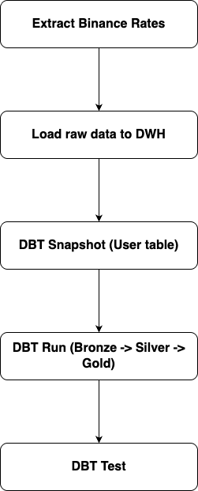
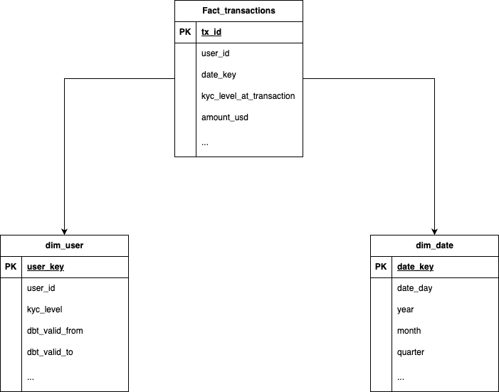

# Architecture and Project Documentation

# 1. Project Structure
```
rtm-de-project/
├── data/
│   ├── users.csv
│   ├── transactions.csv
│   └── output/
│       └── raw_rates/
├── ingestion/
│   ├── binance_rate_extractor.py
│   └── requirements.txt
├── rmt_dbt_bigquery/
│   ├── models/
│   │   ├── staging/
│   │   ├── intermediate/
│   │   └──  marts/
│   │       └── raw_rates/
│   ├── snapshots/
│   ├── seeds/
│   └── dbt_project.yml
├── airflow/
│   └── dags/
└── ARCHITECTURE.md
```

---

# 2. Bài 1 – Ingestion: Thu thập dữ liệu tỷ giá từ Binance

## **Mục tiêu**
Tải dữ liệu tỷ giá crypto theo giờ từ Binance để quy đổi về USD, phục vụ phân tích giao dịch.

## **Phạm vi dữ liệu**
Từ `transactions.csv` lấy:
- Tất cả `source_currency` và `destination_currency`
- Chuyển sang cặp **USDT** để get từ Binance: `BTCUSDT`, `ETHUSDT`, ...
- `start_time = min(created_at)`
- `end_time = max(created_at)`
- Dữ liệu Binance được lấy theo `interval` 1h.

## **Call API Binance `/api/v3/klines`**
- Mỗi request trả tối đa 1000 rows
- Dữ liệu gồm: open, high, low, close, volume, open_time, close_time, thêm field `symbol`
- Dùng **close_price** để quy đổi sang USD

## **Lưu dữ liệu Bronze**
- Lưu dạng `.parquet` hoặc `.csv` trong `output/raw_rates/`

---

# 3. Bài 2 – Data Modeling với dbt (Bronze → Silver → Gold)

## **Mục tiêu nghiệp vụ**
1. Tính `total_volume` theo ngày/tháng/quý (USD)
2. Xem giao dịch `COMPLETED` theo từng cấp độ `KYC`
3. Khi xem giao dịch cũ, phải biết **kyc_level tại thời điểm giao dịch**.

Dùng **SCD2** để `snapshots historical users data` sau đó tính toán thêm field `kyc_level_at_tx`.
Sử dụng **Star Schema Data Warehousing models** với 1 bảng fact_transaction ở trung tâm liên kết với
dim_user và dim_date cho mục đích phân tích các nghiệp vụ như yêu cầu.
Lý do:
- Đơn giản
- Nhanh do ít phép join
- Dataset khá nhỏ

---

# 3.1 Bronze Layer (Staging Models)
Bronze chỉ dọn dẹp cơ bản:
- rename column
- convert data type
- không thay đổi meaning dữ liệu

Models:
```
stg_users
stg_transactions
stg_rates
```
Mỗi model có test:  
- unique, not_null cho primary key  
- not_null cho các cột timestamp quan trọng

---

# 3.2 Silver Layer (Intermediate)

## **3.2.1 Snapshot Users: SCD2 cho lịch sử KYC**
Dùng `dbt snapshot`:
- `strategy = timestamp`
- `updated_at = updated_at`
- Tạo các cột: `dbt_valid_from`, `dbt_valid_to`, `is_current`

## **3.2.2 Dim_user từ snapshot**
Tạo dimension chuẩn Kimball:
- user_sk (surrogate key)
- user_id
- kyc_level
- dbt_valid_from
- dbt_valid_to
- is_current
- created_at
- updated_at

**Dim_user** dùng để join vào fact để lấy đúng kyc_level tại thời điểm giao dịch.

## **3.2.3 fact_transactions**
`fact_transaction_enriched`:
- tx_id,
- user_id
- created_at,
- created_at_hour
- usd_value
- user_sk
- kyc_level_at_tx
- valuation_symbol

---

# 3.3 Gold Layer (Marts/reports)

## **3.3.1 report_daily_volume_usd**
Group theo:
- day/month/quarter
- sum(usd_value)

## **3.3.2 report_completed_volume_by_kyc**
Group theo:
- kyc_level_at_transaction
- time grain (day/month/quarter)
- count transactions
- sum(usd_value)

## **3.3.3 report_transaction_audit**
One Big Table phục vụ BI:
- tx_id, 
- user_id
- usd_value
- date fields
- kyc_level_at_tx

---

# 4. Bài 3 – Kiến trúc & Lưu trữ

## **4.1 Lựa chọn DWH**
Đề xuất: **BigQuery**
- Không cần quản lý Infrastructure.
- Tối ưu tốt cho large-scale analytical workload
- Cost-effective cho batch processing
- Tích hợp với dbt

Alternatives: Snowflake, Databricks, Redshift Serverless.

---

# 4.2 dbt Materialization Strategy
| Layer | Materialization | Lý do                         |
|-------|----------------|-------------------------------|
| Staging (Bronze) | view | Rẻ, nhẹ, không cần lưu table  |
| Intermediate (Silver) | table | Tránh join lặp lại, tối ưu BI |
| Marts (Gold) | table / incremental | Stable, BI-friendly           |
| Snapshots | snapshot | Dùng để historical tracking   |

---

# 4.3 Orchestration
**Airflow** hoặc **dbt Cloud** cho DBT.

## **Pipeline DAG**

---

# 5. Sơ đồ ERD
Kiến trúc DWH:


→ Đảm bảo **Single Source of Truth** cho cả `transactions` và `kyc_level_at_transaction`.
